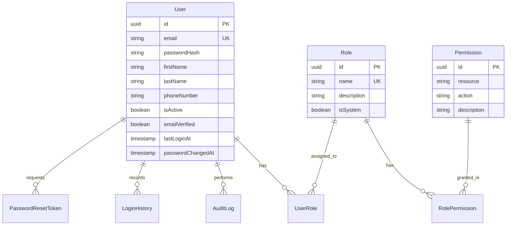
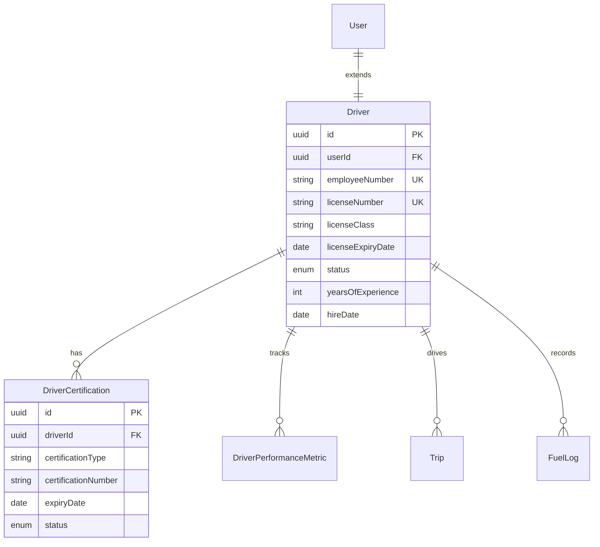
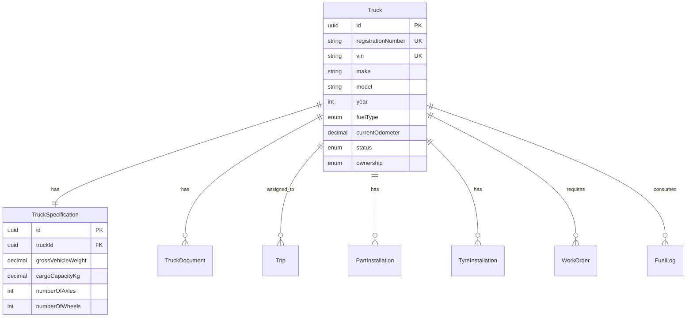
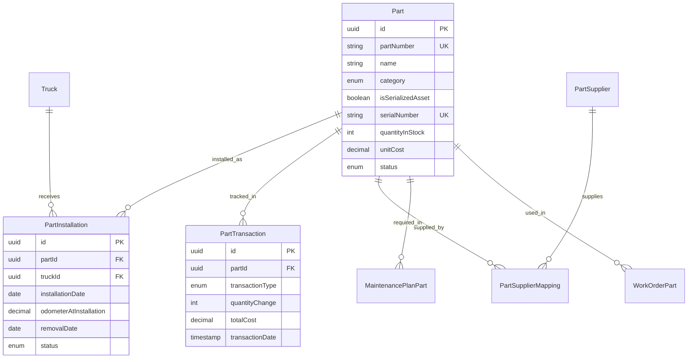
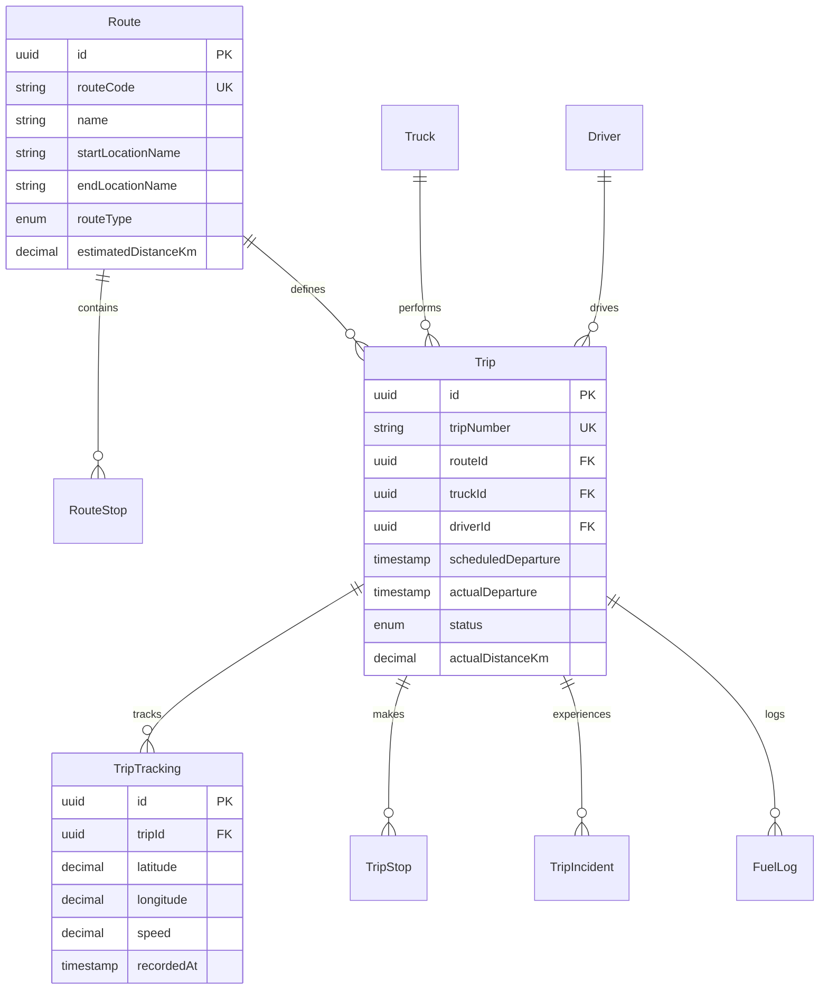
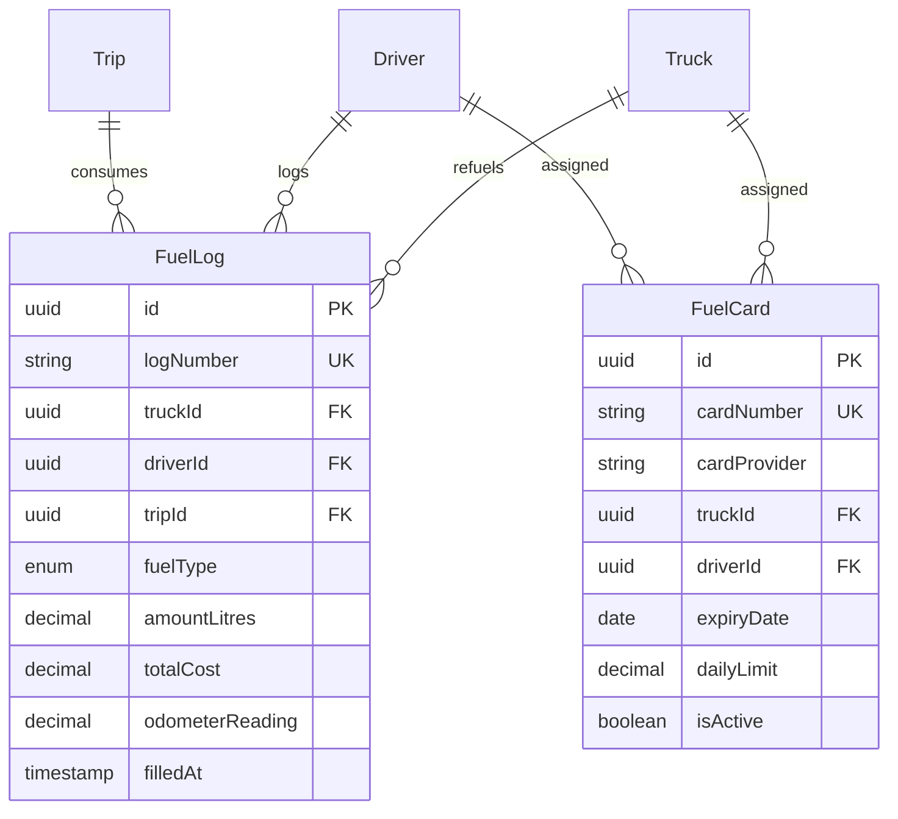
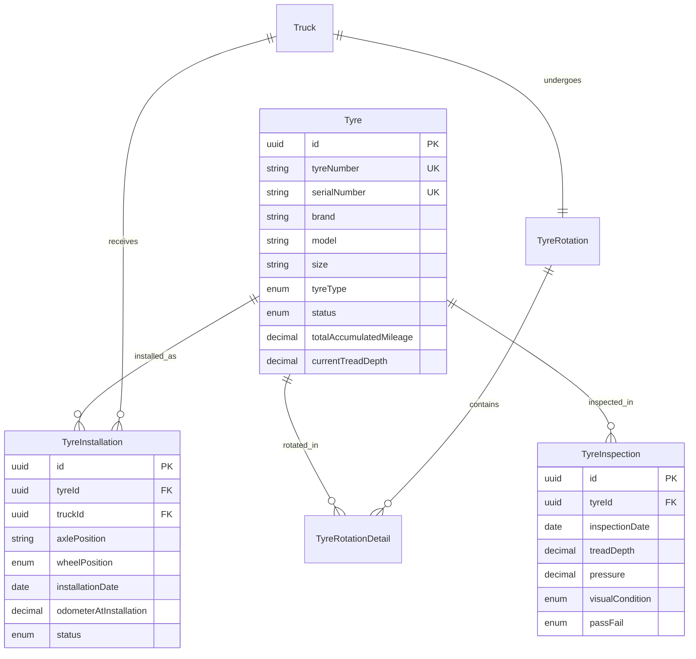
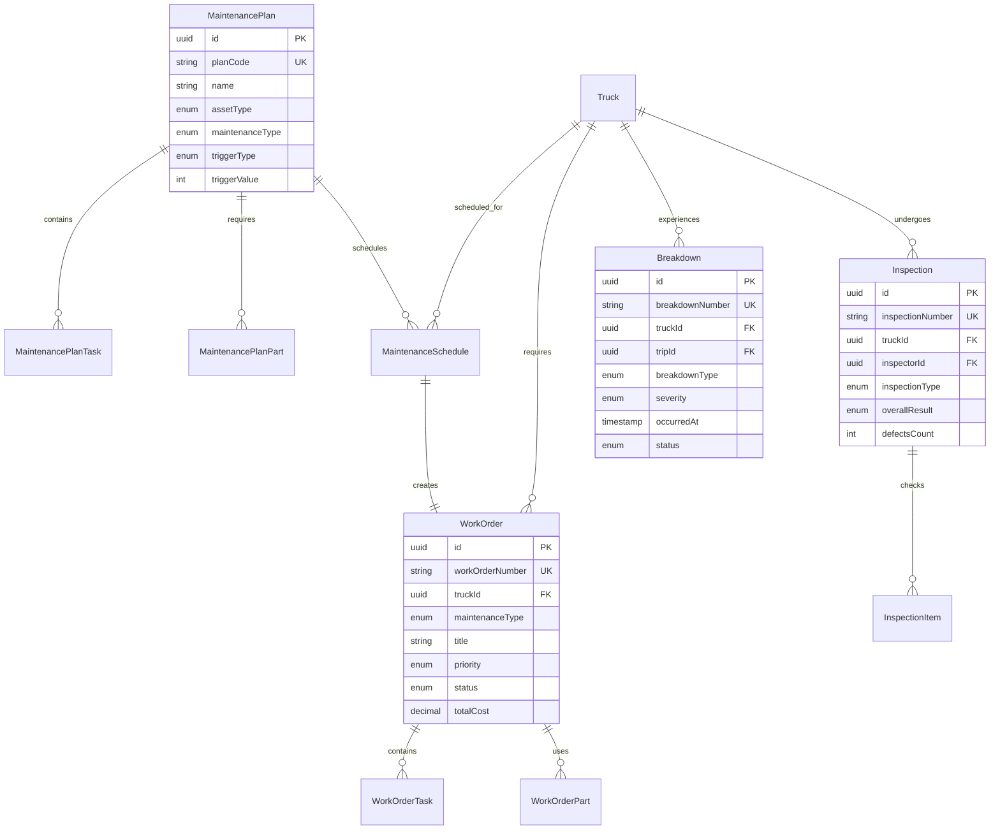
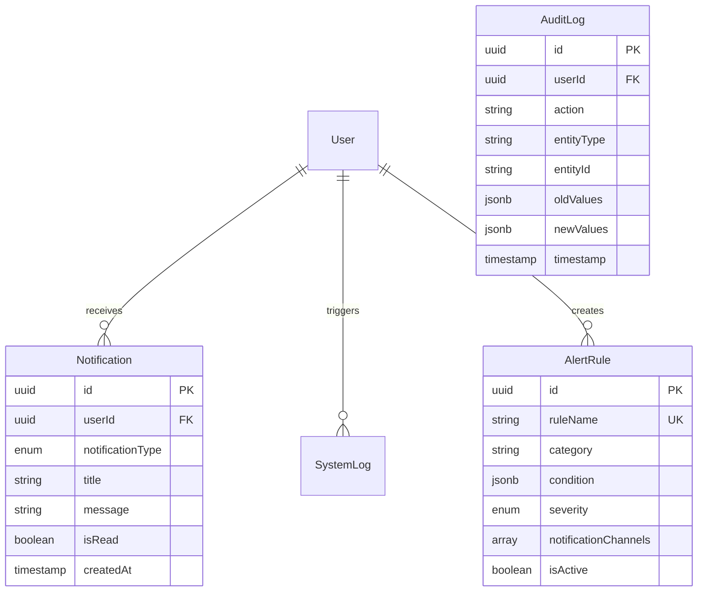

# Fleet Management System - Entity Relationship Diagram

This document contains the Entity Relationship Diagrams for the Fleet Management System using Mermaid syntax.

## Core User Management

## Driver Management

## Truck & Asset Management

## Parts & Inventory Management

## Route & Trip Management

## Fuel Management

## Tyre Management

## Maintenance Management

## System & Notifications

## Key Relationships Summary

### One-to-One (||--||)
- User ↔ Driver
- Truck ↔ TruckSpecification

### One-to-Many (||--o{)
- User → UserRole, AuditLog, LoginHistory, Notification
- Role → UserRole, RolePermission
- Truck → Trip, PartInstallation, TyreInstallation, WorkOrder, FuelLog
- Route → RouteStop, Trip
- Trip → TripTracking, TripStop, TripIncident
- Part → PartInstallation, PartTransaction
- Tyre → TyreInstallation, TyreInspection
- MaintenancePlan → MaintenanceSchedule, MaintenancePlanTask
- WorkOrder → WorkOrderTask, WorkOrderPart
- Inspection → InspectionItem

### Many-to-Many (via Junction Tables)
- User ↔ Role (via UserRole)
- Role ↔ Permission (via RolePermission)
- Part ↔ Supplier (via PartSupplierMapping)
- MaintenancePlan ↔ Part (via MaintenancePlanPart)
- WorkOrder ↔ Part (via WorkOrderPart)

## Indexing Strategy

### Primary Keys
- All tables use UUID primary keys

### Unique Indexes
- Business keys (email, VIN, registrationNumber, licenseNumber, etc.)
- Composite unique constraints on junction tables

### Foreign Key Indexes
- All foreign keys automatically indexed

### Performance Indexes
- Timestamp fields (createdAt, updatedAt)
- Status fields for filtering
- Composite indexes for common query patterns

### Spatial Indexes
- Geography columns for location-based queries

---

This ERD provides a complete visual representation of the database schema for the Fleet Management System.
