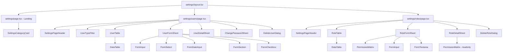
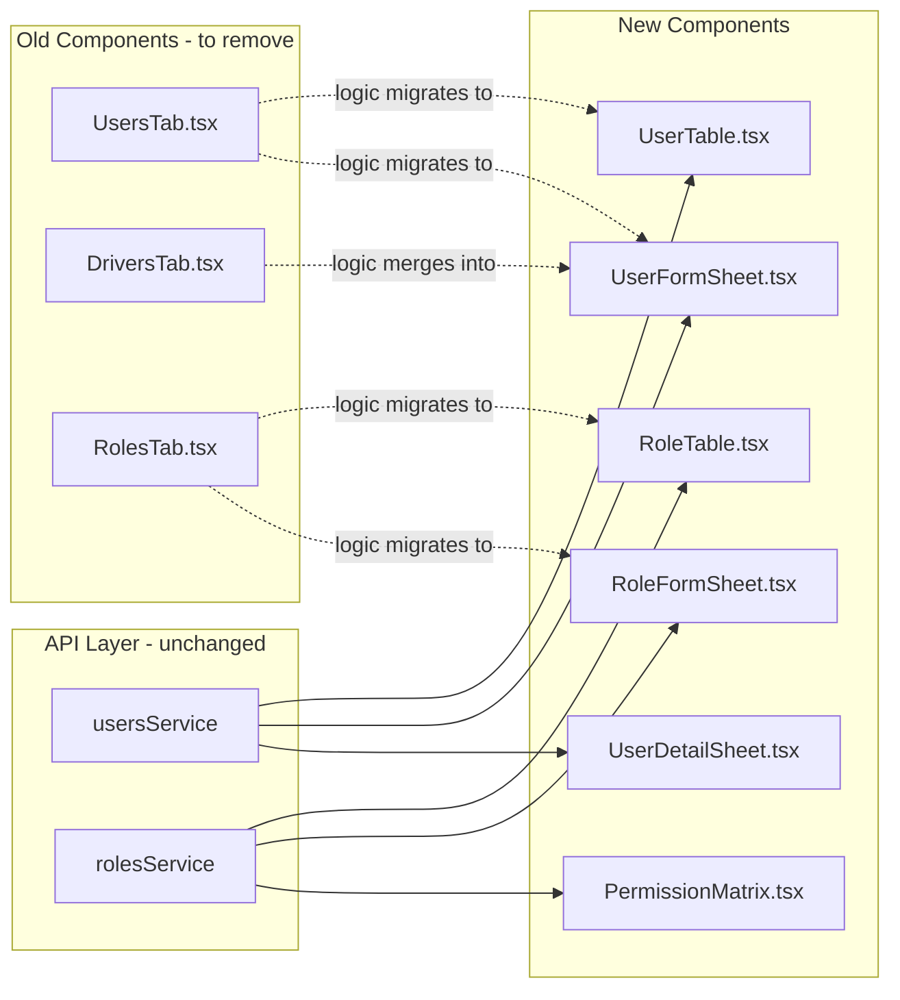

# Settings Section Redesign — Architecture Document

> **Status:** Draft  
> **Last updated:** 2026-02-21  
> **Scope:** Replace the tab-based settings UI with a dashboard-style admin setup area

---

## Table of Contents

1. [Overview & Goals](#1-overview--goals)
2. [New Route Structure](#2-new-route-structure)
3. [Settings Landing Page](#3-settings-landing-page)
4. [Users Page](#4-users-page)
5. [Roles & Permissions Page](#5-roles--permissions-page)
6. [Component Hierarchy](#6-component-hierarchy)
7. [Type Definitions](#7-type-definitions)
8. [UI/UX Patterns & Design System](#8-uiux-patterns--design-system)
9. [Migration Plan](#9-migration-plan)
10. [Future Extensibility](#10-future-extensibility)

---

## 1. Overview & Goals

### Current Pain Points

- The **tab-based layout** (`layout.tsx`) forces a horizontal navigation pattern that doesn't scale — adding vehicle categories, fuel types, or notification settings would make tabs overflow
- **Drivers are treated as a separate entity** with their own tab (`DriversTab.tsx`) and route (`/settings/drivers`), but the API models them as users with `type: 'DRIVER'`
- The settings `page.tsx` is a blind redirect to `/settings/users` — there is no overview or entry point

### Design Goals

| Goal | Description |
|------|-------------|
| **Dashboard landing** | Replace the redirect with a card-grid landing page showing all setup categories |
| **Unified users** | Merge drivers/turnboys into a single users page with type-based filtering |
| **Proper roles UI** | Reimagine the roles page with a visual permission matrix |
| **Extensibility** | Architecture that accommodates future setup areas without layout changes |
| **Consistency** | Match existing dashboard patterns — `Card`, `DataTable`, `Sheet`, `Button` from shadcn/ui |

---

## 2. New Route Structure

### File Tree

```
app/(dashboard)/settings/
├── _types.ts                              # Updated type definitions
├── layout.tsx                             # Minimal layout — NO tabs, just breadcrumb + children
├── page.tsx                               # ★ Settings landing page (card grid)
├── _components/
│   ├── index.ts                           # Barrel export
│   ├── SettingsCategoryCard.tsx            # Reusable card for landing page
│   ├── SettingsPageHeader.tsx             # Shared page header with breadcrumb + action
│   ├── UserTypeFilter.tsx                 # Toggle/filter bar for user types
│   ├── UserTable.tsx                      # DataTable for all users
│   ├── UserFormSheet.tsx                  # Sheet: create/edit user
│   ├── UserDetailSheet.tsx               # Sheet: view user detail
│   ├── ChangePasswordSheet.tsx           # Sheet: change password
│   ├── DeleteUserDialog.tsx              # Confirmation dialog for delete
│   ├── RoleTable.tsx                     # DataTable for roles list
│   ├── RoleFormSheet.tsx                 # Sheet: create/edit role with permission matrix
│   ├── RoleDetailSheet.tsx              # Sheet: view role detail + assigned users
│   ├── PermissionMatrix.tsx             # Checkbox grid grouped by resource
│   └── DeleteRoleDialog.tsx             # Confirmation dialog for role delete
├── users/
│   └── page.tsx                          # Users management page
└── roles/
    └── page.tsx                          # Roles & permissions page
```

### Routes Removed

| Route | Reason |
|-------|--------|
| `/settings/drivers` | Merged into `/settings/users` with type filter |

### Route Purpose Summary

| Route | Purpose |
|-------|---------|
| `/settings` | Landing page — card grid of setup categories |
| `/settings/users` | Full user management — all types, CRUD, role assignment |
| `/settings/roles` | Role management — CRUD with permission matrix |

---

## 3. Settings Landing Page

### Route: `/settings` → [`page.tsx`](app/(dashboard)/settings/page.tsx)

The landing page replaces the current blind redirect. It renders a header and a responsive card grid linking to each setup sub-section.

### Wireframe

```
┌──────────────────────────────────────────────────────────────┐
│  Settings                                                     │
│  System configuration and administration                      │
├──────────────────────────────────────────────────────────────┤
│                                                               │
│  ┌─────────────────┐  ┌─────────────────┐  ┌──────────────┐ │
│  │  👥 Users        │  │  🔐 Roles &     │  │  🚗 Vehicle  │ │
│  │                  │  │  Permissions     │  │  Categories  │ │
│  │  Manage system   │  │                  │  │              │ │
│  │  users, drivers  │  │  Configure roles │  │  Coming soon │ │
│  │  & turn boys     │  │  and access      │  │              │ │
│  │                  │  │  control         │  │              │ │
│  │  12 users        │  │  5 roles         │  │              │ │
│  │  ─────────────── │  │  ─────────────── │  │  ────────── │ │
│  │  Manage →        │  │  Manage →        │  │  Soon →     │ │
│  └─────────────────┘  └─────────────────┘  └──────────────┘ │
│                                                               │
│  ┌─────────────────┐  ┌─────────────────┐                    │
│  │  ⛽ Fuel Types   │  │  🔔 Notifications│                   │
│  │                  │  │                  │                    │
│  │  Coming soon     │  │  Coming soon     │                   │
│  │                  │  │                  │                    │
│  │  ─────────────── │  │  ─────────────── │                   │
│  │  Soon →          │  │  Soon →          │                   │
│  └─────────────────┘  └─────────────────┘                    │
│                                                               │
└──────────────────────────────────────────────────────────────┘
```

### Layout Structure

```tsx
{/* Container */}
<div className="space-y-6">

  {/* Header */}
  <div className="flex flex-col gap-4 md:flex-row md:items-center md:justify-between">
    <div>
      <h2 className="text-3xl font-bold tracking-tight text-gray-900">Settings</h2>
      <p className="text-sm text-gray-500">System configuration and administration</p>
    </div>
  </div>

  {/* Category Grid */}
  <div className="grid gap-4 sm:grid-cols-2 lg:grid-cols-3">
    <SettingsCategoryCard ... />
    <SettingsCategoryCard ... />
    {/* Future items */}
  </div>

</div>
```

### SettingsCategoryCard Component

**File:** [`_components/SettingsCategoryCard.tsx`](app/(dashboard)/settings/_components/SettingsCategoryCard.tsx)

```tsx
interface SettingsCategoryCardProps {
  icon: LucideIcon;
  iconColor: string;          // e.g. "text-blue-600"
  iconBg: string;             // e.g. "bg-blue-50"
  title: string;
  description: string;
  href: string;
  stat?: string;              // e.g. "12 users"
  disabled?: boolean;         // For "coming soon" items
  badge?: string;             // e.g. "Coming Soon"
}
```

**Visual Design:**

- Uses shadcn `Card` component
- Icon in a colored circle top-left: `<div className="h-10 w-10 rounded-lg {iconBg} flex items-center justify-center">`
- Title: `text-base font-semibold text-gray-900`
- Description: `text-sm text-gray-500 mt-1`
- Bottom section separated by `border-t border-gray-100 mt-4 pt-3`:
  - Left: stat in `text-xs text-gray-400`
  - Right: "Manage →" link in `text-sm font-medium text-blue-600`
- Disabled state: `opacity-60 pointer-events-none` with a "Coming Soon" badge
- Hover: `hover:shadow-md hover:border-gray-300 transition-all duration-200`

### Landing Page Data

The landing page fetches counts asynchronously to display stats on each card:

```tsx
const categories = [
  {
    icon: Users,
    iconColor: 'text-blue-600',
    iconBg: 'bg-blue-50',
    title: 'Users',
    description: 'Manage system users, drivers, and turn boys',
    href: '/settings/users',
    stat: `${userCount} users`,
  },
  {
    icon: Shield,
    iconColor: 'text-purple-600',
    iconBg: 'bg-purple-50',
    title: 'Roles & Permissions',
    description: 'Configure roles and access control policies',
    href: '/settings/roles',
    stat: `${roleCount} roles`,
  },
  // Future — disabled
  {
    icon: Car,
    iconColor: 'text-emerald-600',
    iconBg: 'bg-emerald-50',
    title: 'Vehicle Categories',
    description: 'Manage vehicle types and classification',
    href: '/settings/vehicle-categories',
    disabled: true,
    badge: 'Coming Soon',
  },
];
```

---

## 4. Users Page

### Route: `/settings/users` → [`users/page.tsx`](app/(dashboard)/settings/users/page.tsx)

This page replaces both the old `UsersTab` and `DriversTab`. It shows ALL user types in one unified interface with type-based filtering.

### Wireframe

```
┌──────────────────────────────────────────────────────────────┐
│  ← Settings / Users                                          │
│                                                    [+ Add User]│
├──────────────────────────────────────────────────────────────┤
│                                                               │
│  ┌────────────────────────────────────────────────────────┐  │
│  │ 🔍 Search users...          │ Type: [All ▾] │ Status ▾ │  │
│  └────────────────────────────────────────────────────────┘  │
│                                                               │
│  ┌─ Type Filter Pills ────────────────────────────────────┐  │
│  │ [All: 12] [System: 4] [Admin: 2] [Driver: 5] [Mgr: 1] │  │
│  └────────────────────────────────────────────────────────┘  │
│                                                               │
│  ┌────────────────────────────────────────────────────────┐  │
│  │ Name          │ Email        │ Type   │ Roles  │ Status│  │
│  │───────────────┼──────────────┼────────┼────────┼───────│  │
│  │ John Doe      │ john@...     │ DRIVER │ Driver │ ● Act │  │
│  │ Jane Smith    │ jane@...     │ SYSTEM │ Admin  │ ● Act │  │
│  │ Mike K.       │ mike@...     │ DRIVER │ Driver │ ○ Ina │  │
│  │ ...           │              │        │        │       │  │
│  └────────────────────────────────────────────────────────┘  │
│                                                               │
│  ◄ 1 2 3 ... 5 ►            Showing 1-10 of 48 users        │
│                                                               │
└──────────────────────────────────────────────────────────────┘
```

### Page Structure

```tsx
<div className="space-y-6">
  {/* Header with breadcrumb */}
  <SettingsPageHeader
    breadcrumb={[
      { label: 'Settings', href: '/settings' },
      { label: 'Users' },
    ]}
    title="Users"
    description="Manage system users, drivers, and turn boys"
    action={
      <Button onClick={openCreateSheet}>
        <Plus className="mr-2 h-4 w-4" /> Add User
      </Button>
    }
  />

  {/* Filter Bar */}
  <div className="flex flex-col gap-4 sm:flex-row sm:items-center sm:justify-between">
    {/* Search */}
    <div className="relative flex-1 max-w-sm">
      <Search className="absolute left-3 top-1/2 -translate-y-1/2 h-4 w-4 text-gray-400" />
      <Input placeholder="Search users..." className="pl-9" />
    </div>
    {/* Dropdown filters */}
    <div className="flex items-center gap-2">
      <Select> {/* Status filter */} </Select>
    </div>
  </div>

  {/* Type Filter Pills */}
  <UserTypeFilter
    types={USER_TYPES}
    activeType={activeType}
    counts={typeCounts}
    onChange={setActiveType}
  />

  {/* Data Table */}
  <UserTable
    data={filteredUsers}
    onEdit={openEditSheet}
    onDelete={openDeleteDialog}
    onChangePassword={openPasswordSheet}
    onViewDetail={openDetailSheet}
  />

  {/* Pagination */}
  <Pagination ... />

  {/* Sheets & Dialogs */}
  <UserFormSheet ... />
  <UserDetailSheet ... />
  <ChangePasswordSheet ... />
  <DeleteUserDialog ... />
</div>
```

### UserTypeFilter Component

**File:** [`_components/UserTypeFilter.tsx`](app/(dashboard)/settings/_components/UserTypeFilter.tsx)

A horizontal pill/toggle bar that filters users by type. Inspired by the pattern used in modern admin panels.

```tsx
interface UserTypeFilterProps {
  types: Array<{ value: UserType | 'ALL'; label: string }>;
  activeType: UserType | 'ALL';
  counts: Record<UserType | 'ALL', number>;
  onChange: (type: UserType | 'ALL') => void;
}
```

**Visual Design:**

```
[All: 12] [System: 4] [Admin: 2] [Driver: 5] [Manager: 1]
```

- Container: `flex flex-wrap gap-2`
- Each pill: `px-3 py-1.5 rounded-full text-sm font-medium cursor-pointer transition-colors`
- Active: `bg-blue-100 text-blue-700 border border-blue-200`
- Inactive: `bg-gray-100 text-gray-600 hover:bg-gray-200 border border-transparent`
- Count badge: `ml-1.5 text-xs opacity-70`

### UserTable Component

**File:** [`_components/UserTable.tsx`](app/(dashboard)/settings/_components/UserTable.tsx)

Uses the existing `DataTable` component from [`components/ui/data-table.tsx`](components/ui/data-table.tsx).

**Columns:**

| Column | Content | Notes |
|--------|---------|-------|
| Name | Avatar + full name | `Avatar` with initials fallback |
| Email | Email address | Clickable `mailto:` link |
| Type | User type badge | Color-coded `Badge` |
| Roles | Comma-separated role names | Truncated with tooltip |
| Status | Active/Inactive badge | Green dot for active |
| Actions | Edit / Password / Delete | `DropdownMenu` trigger |

**Type Badge Colors:**

| Type | Badge Style |
|------|-------------|
| SYSTEM | `bg-slate-100 text-slate-700` |
| ADMIN | `bg-purple-100 text-purple-700` |
| DRIVER | `bg-blue-100 text-blue-700` |
| MANAGER | `bg-amber-100 text-amber-700` |

**Mobile Card Layout (via `mobileCard` prop):**

```
┌────────────────────────────┐
│  JD  John Doe        ● Active
│       john@fleet.com
│       DRIVER  •  Driver Role
│  ─────────────────────────
│  [Edit]  [Password]  [Delete]
└────────────────────────────┘
```

### UserFormSheet Component

**File:** [`_components/UserFormSheet.tsx`](app/(dashboard)/settings/_components/UserFormSheet.tsx)

A side-panel `Sheet` (right, size `lg`) for creating and editing users. The form adapts based on the selected user type — driver-specific fields appear conditionally.

**Form Sections:**

```
┌─ Sheet ──────────────────────────────────┐
│  Create User / Edit User                  │
│  ─────────────────────────────────────── │
│                                           │
│  ▸ Basic Information                      │
│    First Name*    [______________]        │
│    Last Name*     [______________]        │
│    Email*         [______________]        │
│    Phone*         [______________]        │
│                                           │
│  ▸ Account Settings                       │
│    User Type*     [SYSTEM ▾     ]        │
│    Password*      [______________]  ← only on create
│    Confirm*       [______________]  ← only on create
│    Roles          [☑ Admin ☐ Driver]     │
│                                           │
│  ▸ Driver Profile  ← only if type=DRIVER │
│    License #      [______________]        │
│    License Expiry [____ / ____ ]         │
│    License Class  [______________]        │
│    Date of Birth  [____ / ____ ]         │
│    Emergency Name [______________]        │
│    Emergency Phone[______________]        │
│    Hire Date      [____ / ____ ]         │
│    Notes          [______________]        │
│                                           │
│  ─────────────────────────────────────── │
│  [Cancel]                     [Save User] │
└──────────────────────────────────────────┘
```

**Key Behaviors:**

- Uses [`FormInput`](components/ui/form/FormInput.tsx), [`FormSelect`](components/ui/form/FormSelect.tsx), [`FormDateInput`](components/ui/form/FormDateInput.tsx), [`FormTextarea`](components/ui/form/FormTextarea.tsx) from the existing form component library
- Uses [`FormSection`](components/ui/form/FormSection.tsx) to group fields
- Conditional rendering: Driver Profile section only visible when `type === 'DRIVER'`
- On edit mode, password fields are hidden — use separate `ChangePasswordSheet`
- Role assignment via checkboxes fetched from `rolesService.getRoles()`
- Calls `usersService.createUser()` or `usersService.updateUser()`

### UserDetailSheet Component

**File:** [`_components/UserDetailSheet.tsx`](app/(dashboard)/settings/_components/UserDetailSheet.tsx)

Read-only sheet showing full user details. Opens on row click.

```
┌─ Sheet ──────────────────────────────────┐
│  User Details                             │
│  ─────────────────────────────────────── │
│                                           │
│  ┌─────┐                                 │
│  │ JD  │  John Doe                       │
│  └─────┘  john.doe@fleet.com             │
│            +254 712 345 678              │
│            ● Active  •  DRIVER           │
│                                           │
│  ▸ Roles                                  │
│    • Driver                               │
│    • Fleet Viewer                         │
│                                           │
│  ▸ Driver Profile  ← only for drivers    │
│    License: DL-001234                     │
│    Expiry: 2027-06-15                    │
│    Class: BCE                             │
│    Hired: 2024-01-15                     │
│                                           │
│  ▸ Account Info                           │
│    Last login: 2026-02-20 14:30          │
│    Created: 2025-03-10                   │
│                                           │
│  ─────────────────────────────────────── │
│  [Edit User]  [Change Password]  [Delete] │
└──────────────────────────────────────────┘
```

### ChangePasswordSheet Component

**File:** [`_components/ChangePasswordSheet.tsx`](app/(dashboard)/settings/_components/ChangePasswordSheet.tsx)

Minimal sheet for admin password changes.

```
┌─ Sheet (sm) ─────────────────────────────┐
│  Change Password                          │
│  for John Doe                             │
│  ─────────────────────────────────────── │
│                                           │
│  New Password*     [______________]      │
│  Confirm Password* [______________]      │
│                                           │
│  ─────────────────────────────────────── │
│  [Cancel]               [Change Password] │
└──────────────────────────────────────────┘
```

Calls `usersService.changePassword()`.

### DeleteUserDialog Component

**File:** [`_components/DeleteUserDialog.tsx`](app/(dashboard)/settings/_components/DeleteUserDialog.tsx)

A centered confirmation dialog (not a sheet). Uses a custom dialog or the Radix `AlertDialog`.

```
┌──────────────────────────────────┐
│  ⚠ Delete User                   │
│                                   │
│  Are you sure you want to delete │
│  John Doe? This action cannot    │
│  be undone.                       │
│                                   │
│  [Cancel]        [Delete User]   │
└──────────────────────────────────┘
```

---

## 5. Roles & Permissions Page

### Route: `/settings/roles` → [`roles/page.tsx`](app/(dashboard)/settings/roles/page.tsx)

### Wireframe

```
┌──────────────────────────────────────────────────────────────┐
│  ← Settings / Roles & Permissions                            │
│                                                    [+ Add Role]│
├──────────────────────────────────────────────────────────────┤
│                                                               │
│  ┌────────────────────────────────────────────────────────┐  │
│  │ 🔍 Search roles...                                     │  │
│  └────────────────────────────────────────────────────────┘  │
│                                                               │
│  ┌────────────────────────────────────────────────────────┐  │
│  │ Role Name     │ Description      │ Users │ Perms │  ⋮  │  │
│  │───────────────┼──────────────────┼───────┼───────┼─────│  │
│  │ 🔒 Admin      │ Full system...   │  3    │  24   │ ⋮   │  │
│  │ 🔒 Manager    │ Fleet mgmt...    │  5    │  18   │ ⋮   │  │
│  │    Custom Role │ Limited...       │  2    │  8    │ ⋮   │  │
│  └────────────────────────────────────────────────────────┘  │
│                                                               │
└──────────────────────────────────────────────────────────────┘
```

### Page Structure

```tsx
<div className="space-y-6">
  <SettingsPageHeader
    breadcrumb={[
      { label: 'Settings', href: '/settings' },
      { label: 'Roles & Permissions' },
    ]}
    title="Roles & Permissions"
    description="Configure roles and manage access control"
    action={
      <Button onClick={openCreateSheet}>
        <Plus className="mr-2 h-4 w-4" /> Add Role
      </Button>
    }
  />

  {/* Search */}
  <div className="relative max-w-sm">
    <Search className="absolute left-3 top-1/2 -translate-y-1/2 h-4 w-4 text-gray-400" />
    <Input placeholder="Search roles..." className="pl-9" />
  </div>

  {/* Roles Table */}
  <RoleTable
    data={roles}
    onEdit={openEditSheet}
    onDelete={openDeleteDialog}
    onViewDetail={openDetailSheet}
  />

  {/* Sheets & Dialogs */}
  <RoleFormSheet ... />
  <RoleDetailSheet ... />
  <DeleteRoleDialog ... />
</div>
```

### RoleTable Component

**File:** [`_components/RoleTable.tsx`](app/(dashboard)/settings/_components/RoleTable.tsx)

**Columns:**

| Column | Content | Notes |
|--------|---------|-------|
| Role Name | Name + system lock icon | 🔒 for `isSystem: true` |
| Description | Role description | Truncated |
| Users | User count | `_count.users` from API |
| Permissions | Permission count | `permissions.length` |
| Actions | Edit / View / Delete | System roles: view only, no delete |

**Mobile Card:**

```
┌────────────────────────────────┐
│  🔒 Admin                      │
│  Full system access             │
│  3 users  •  24 permissions     │
│  ───────────────────────────── │
│  [View]  [Edit]                 │
└────────────────────────────────┘
```

### RoleFormSheet Component

**File:** [`_components/RoleFormSheet.tsx`](app/(dashboard)/settings/_components/RoleFormSheet.tsx)

Sheet with size `xl` to accommodate the permission matrix.

```
┌─ Sheet (xl) ─────────────────────────────────────────┐
│  Create Role / Edit Role                              │
│  ───────────────────────────────────────────────────  │
│                                                       │
│  ▸ Role Information                                   │
│    Name*          [______________]                    │
│    Description*   [________________________]         │
│                                                       │
│  ▸ Permissions                                        │
│    ┌─────────────────────────────────────────────┐   │
│    │ 🔍 Filter permissions...                    │   │
│    ├─────────────────────────────────────────────┤   │
│    │                                              │   │
│    │  USERS                          [Select All] │   │
│    │  ☑ users:create   Create users              │   │
│    │  ☑ users:read     Read users                │   │
│    │  ☐ users:update   Update users              │   │
│    │  ☐ users:delete   Delete users              │   │
│    │                                              │   │
│    │  TRUCKS                         [Select All] │   │
│    │  ☑ trucks:create  Create trucks             │   │
│    │  ☐ trucks:read    Read trucks               │   │
│    │  ☐ trucks:update  Update trucks             │   │
│    │  ☐ trucks:delete  Delete trucks             │   │
│    │                                              │   │
│    │  ROLES                          [Select All] │   │
│    │  ☐ roles:create   Create roles              │   │
│    │  ☐ roles:read     Read roles                │   │
│    │  ☐ roles:update   Update roles              │   │
│    │  ☐ roles:delete   Delete roles              │   │
│    │                                              │   │
│    └─────────────────────────────────────────────┘   │
│                                                       │
│  ───────────────────────────────────────────────────  │
│  [Cancel]                              [Save Role]    │
└──────────────────────────────────────────────────────┘
```

### PermissionMatrix Component

**File:** [`_components/PermissionMatrix.tsx`](app/(dashboard)/settings/_components/PermissionMatrix.tsx)

The core of the roles redesign. Groups permissions by resource and displays checkboxes.

```tsx
interface PermissionMatrixProps {
  permissions: Permission[];           // All available permissions
  selectedIds: Set<string>;            // Currently selected permission IDs
  onChange: (ids: Set<string>) => void;
  disabled?: boolean;                  // For view-only mode
  filter?: string;                     // Search filter text
}
```

**Visual Design:**

- Groups permissions by `resource` field (USERS, TRUCKS, ROLES, etc.)
- Each group has a header row with resource name + "Select All" toggle
- Resource header: `bg-gray-50 px-4 py-2 text-xs font-semibold uppercase tracking-wider text-gray-600 flex items-center justify-between`
- Each permission row: `px-4 py-2.5 flex items-center gap-3 hover:bg-gray-50`
- Checkbox: uses `Checkbox` from shadcn
- Permission label: `text-sm text-gray-900`
- Permission description: `text-xs text-gray-500`
- Group separator: `border-b border-gray-100`
- "Select All" per group: toggles all permissions in that resource
- Selected count shown: `text-xs text-blue-600 font-medium` next to group header

### RoleDetailSheet Component

**File:** [`_components/RoleDetailSheet.tsx`](app/(dashboard)/settings/_components/RoleDetailSheet.tsx)

Read-only view of a role with its permissions and assigned users.

```
┌─ Sheet (lg) ─────────────────────────────────────────┐
│  Role Details                                         │
│  ───────────────────────────────────────────────────  │
│                                                       │
│  🔒 Admin                                            │
│  Full system access with all permissions              │
│  System role • 3 users • 24 permissions               │
│                                                       │
│  ▸ Permissions by Resource                            │
│    USERS (4/4)  ████████████████████  100%            │
│    TRUCKS (3/4) ███████████████░░░░░   75%            │
│    ROLES (2/4)  ██████████░░░░░░░░░░   50%            │
│                                                       │
│  ▸ Assigned Users                                     │
│    • john@fleet.com                                   │
│    • jane@fleet.com                                   │
│    • admin@fleet.com                                  │
│                                                       │
│  ───────────────────────────────────────────────────  │
│  [Edit Role]                              [Close]     │
└──────────────────────────────────────────────────────┘
```

### DeleteRoleDialog Component

**File:** [`_components/DeleteRoleDialog.tsx`](app/(dashboard)/settings/_components/DeleteRoleDialog.tsx)

Same pattern as `DeleteUserDialog`. System roles cannot be deleted — the delete action should not appear for system roles.

---

## 6. Component Hierarchy

### Mermaid Diagram



### Shared Components Used

| Component | Source | Used In |
|-----------|--------|---------|
| [`Card`](components/ui/card.tsx) | shadcn/ui | Landing page cards |
| [`Button`](components/ui/button.tsx) | shadcn/ui | All pages — actions |
| [`DataTable`](components/ui/data-table.tsx) | Custom | Users table, Roles table |
| [`Sheet`](components/ui/sheet.tsx) | shadcn/ui | All create/edit/detail panels |
| [`Badge`](components/ui/badge.tsx) | shadcn/ui | Status, type indicators |
| [`Input`](components/ui/input.tsx) | shadcn/ui | Search fields |
| [`Select`](components/ui/select.tsx) | shadcn/ui | Filter dropdowns |
| [`Checkbox`](components/ui/checkbox.tsx) | shadcn/ui | Permission matrix |
| [`Avatar`](components/ui/avatar.tsx) | shadcn/ui | User table name column |
| [`DropdownMenu`](components/ui/dropdown-menu.tsx) | shadcn/ui | Row action menus |
| `Form*` components | Custom | All form sheets |

---

## 7. Type Definitions

### File: [`_types.ts`](app/(dashboard)/settings/_types.ts)

Replace the current types with these updated definitions:

```typescript
// ---------------------------------------------------------------------------
// Settings domain types (view-models)
// ---------------------------------------------------------------------------

import type { UserType, UserStatus, DriverProfile } from '@/api/users/users.types';
import type { Permission, RolePermission } from '@/api/roles/roles.types';
import type { LucideIcon } from 'lucide-react';

// ---- Settings Landing Page ------------------------------------------------

/** Configuration for a settings category card on the landing page. */
export interface SettingsCategory {
  id: string;
  icon: LucideIcon;
  iconColor: string;
  iconBg: string;
  title: string;
  description: string;
  href: string;
  stat?: string;
  disabled?: boolean;
  badge?: string;
}

// ---- Users ----------------------------------------------------------------

/** User as displayed in the settings Users page. */
export interface SettingsUser {
  id: string;
  firstName: string;
  lastName: string;
  email: string;
  phone: string;
  type: UserType;
  status: UserStatus;
  lastLoginAt: string | null;
  createdAt: string;
  roles: Array<{ id: string; name: string }>;
  driverProfile: DriverProfile | null;
}

/** Form data for creating/editing a user. */
export interface UserFormData {
  firstName: string;
  lastName: string;
  email: string;
  phone: string;
  type: UserType;
  password: string;
  confirmPassword: string;
  roleIds: string[];
  // Driver-specific
  licenseNumber: string;
  licenseExpiry: string;
  licenseClass: string;
  dateOfBirth: string;
  emergencyContact: string;
  emergencyPhone: string;
  hireDate: string;
  notes: string;
}

/** User type filter option. */
export interface UserTypeOption {
  value: UserType | 'ALL';
  label: string;
}

// ---- Roles & Permissions --------------------------------------------------

/** Role as displayed in the settings Roles page. */
export interface SettingsRole {
  id: string;
  name: string;
  description: string;
  isSystem: boolean;
  createdAt: string;
  permissions: RolePermission[];
  userCount: number;
}

/** Form data for creating/editing a role. */
export interface RoleFormData {
  name: string;
  description: string;
  permissionIds: string[];
}

/** Permission grouped by resource for the permission matrix. */
export interface PermissionGroup {
  resource: string;
  permissions: Permission[];
}

// ---- Shared ---------------------------------------------------------------

/** Breadcrumb item for the settings page header. */
export interface BreadcrumbItem {
  label: string;
  href?: string;
}

/** Generic sheet state for managing open/close + selected item. */
export interface SheetState<T> {
  open: boolean;
  mode: 'create' | 'edit' | 'view';
  data: T | null;
}
```

### Removed Types

| Type | Reason |
|------|--------|
| `SettingsDriver` | Merged into `SettingsUser` — drivers are users with `type: 'DRIVER'` |
| `SettingsTabProps` | Replaced by proper component props — no more shared tab state |
| `SettingsPermission` | Use `Permission` from API types directly |
| `SettingsPermissionGroup` | Replaced by `PermissionGroup` |

---

## 8. UI/UX Patterns & Design System

### Layout Pattern

```
Dashboard Layout (existing)
└── Settings Layout (new — minimal)
    ├── Landing Page — card grid
    ├── Users Page — header + filters + table + sheets
    └── Roles Page — header + search + table + sheets
```

### Settings Layout (Replaces Tab Layout)

The new [`layout.tsx`](app/(dashboard)/settings/layout.tsx) is minimal — no tabs. It just wraps children in a clean container:

```tsx
export default function SettingsLayout({ children }: { children: React.ReactNode }) {
  return (
    <div className="min-h-screen">
      {children}
    </div>
  );
}
```

The `min-h-screen` and background come from the parent dashboard layout. No extra chrome needed.

### SettingsPageHeader Component

**File:** [`_components/SettingsPageHeader.tsx`](app/(dashboard)/settings/_components/SettingsPageHeader.tsx)

Used on sub-pages (Users, Roles) to provide breadcrumb navigation back to Settings and a consistent header.

```tsx
interface SettingsPageHeaderProps {
  breadcrumb: BreadcrumbItem[];
  title: string;
  description: string;
  action?: React.ReactNode;
}
```

**Visual:**

```
← Settings / Users
─────────────────────────────────────────────
Users                                [+ Add User]
Manage system users, drivers, and turn boys
```

- Breadcrumb: `text-sm text-gray-500` with `→` separators, last item is `text-gray-900 font-medium`
- Back icon: `ChevronLeft` or just link on "Settings"
- Title row: `flex items-center justify-between`
- Title: `text-3xl font-bold tracking-tight text-gray-900` (matches dashboard)
- Description: `text-sm text-gray-500`

### Color Palette

Consistent with the existing dashboard design:

| Element | Color |
|---------|-------|
| Primary action | `bg-blue-600 hover:bg-blue-700 text-white` |
| Page background | `bg-gray-50` (from dashboard layout) |
| Card background | `bg-white border border-gray-200` |
| Active filter | `bg-blue-100 text-blue-700` |
| Success badge | `bg-green-100 text-green-800` |
| Danger action | `bg-red-600 hover:bg-red-700 text-white` |
| System role lock | `text-gray-400` |
| Heading text | `text-gray-900` |
| Body text | `text-gray-600` |
| Muted text | `text-gray-400` / `text-gray-500` |

### Interaction Patterns

| Action | Pattern | Component |
|--------|---------|-----------|
| Create entity | Click button → Sheet slides from right | `Sheet` side=right |
| Edit entity | Row action menu → Sheet slides from right | `Sheet` side=right |
| View detail | Click row → Sheet slides from right | `Sheet` side=right |
| Delete entity | Row action menu → Centered confirmation dialog | Custom `AlertDialog` |
| Change password | Row action menu → Small sheet | `Sheet` side=right size=sm |
| Filter by type | Click pill → Table filters client-side | `UserTypeFilter` |
| Search | Type in search box → Debounced API call or client filter | `Input` with `Search` icon |
| Navigate | Click card → Next.js router push | `Link` or `router.push` |

### Responsive Breakpoints

| Breakpoint | Layout |
|------------|--------|
| Mobile `< 640px` | Single column cards, stacked filters, mobile card view for tables |
| Tablet `640-1024px` | 2-column card grid, side-by-side filters |
| Desktop `> 1024px` | 3-column card grid, full table view |

### Toast Notifications

Use a consistent pattern for success/error feedback after CRUD operations:

- Success: Green toast — "User created successfully"
- Error: Red toast — "Failed to create user: {error message}"
- Should use an existing toast system if available, or implement with simple state-based alerts at page level

---

## 9. Migration Plan

### Data Flow Diagram



### Step-by-Step Migration

1. **Create new `_types.ts`** — Replace old type definitions with the new ones
2. **Create shared components** — `SettingsCategoryCard`, `SettingsPageHeader`, `UserTypeFilter`, `PermissionMatrix`
3. **Create `UserTable.tsx`** — Extract table logic from `UsersTab.tsx`, add type column and badges
4. **Create `UserFormSheet.tsx`** — Merge create/edit logic from `UsersTab.tsx` + driver fields from `DriversTab.tsx`
5. **Create `UserDetailSheet.tsx`** — New component for read-only user view
6. **Create `ChangePasswordSheet.tsx`** — Extract from `UsersTab.tsx`
7. **Create `DeleteUserDialog.tsx`** — Extract from `UsersTab.tsx`
8. **Create `RoleTable.tsx`** — Extract from `RolesTab.tsx`
9. **Create `RoleFormSheet.tsx`** — Extract from `RolesTab.tsx`, integrate `PermissionMatrix`
10. **Create `RoleDetailSheet.tsx`** — New component
11. **Create `DeleteRoleDialog.tsx`** — Extract from `RolesTab.tsx`
12. **Rewrite `settings/page.tsx`** — Landing page with card grid
13. **Rewrite `settings/layout.tsx`** — Remove tabs, minimal wrapper
14. **Rewrite `settings/users/page.tsx`** — Compose new components
15. **Rewrite `settings/roles/page.tsx`** — Compose new components
16. **Delete `settings/drivers/`** — Remove route entirely
17. **Delete old tab components** — `UsersTab.tsx`, `DriversTab.tsx`, `RolesTab.tsx`
18. **Update barrel export** — `_components/index.ts`

### Files to Delete

| File | Reason |
|------|--------|
| `app/(dashboard)/settings/_components/DriversTab.tsx` | Merged into UserFormSheet + UserTable |
| `app/(dashboard)/settings/_components/UsersTab.tsx` | Replaced by UserTable, UserFormSheet, etc. |
| `app/(dashboard)/settings/_components/RolesTab.tsx` | Replaced by RoleTable, RoleFormSheet, etc. |
| `app/(dashboard)/settings/drivers/page.tsx` | Route removed — drivers are users |

---

## 10. Future Extensibility

The card-grid landing page makes it trivial to add new setup areas. Each new area follows the same pattern:

1. Add a new `SettingsCategory` entry to the landing page data
2. Create a new route: `settings/{area}/page.tsx`
3. Create area-specific `_components/` as needed
4. The landing page automatically shows the new card

### Planned Future Categories

| Category | Route | Description |
|----------|-------|-------------|
| Vehicle Categories | `/settings/vehicle-categories` | Manage truck types, classes |
| Fuel Types | `/settings/fuel-types` | Fuel type definitions |
| Notification Settings | `/settings/notifications` | Alert rules, channels |
| Company Profile | `/settings/company` | Organization details |
| Integrations | `/settings/integrations` | Third-party service configs |

Each starts as a disabled "Coming Soon" card on the landing page and is enabled when implemented.
